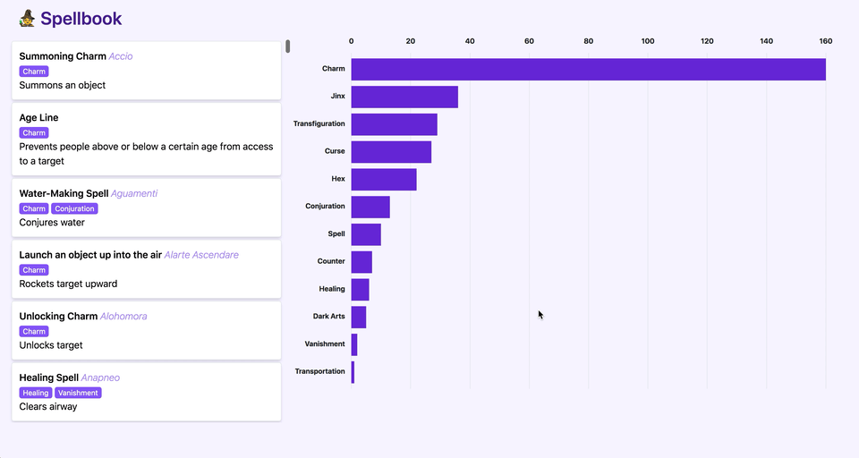

# Testing Spellbook

Materials for an introductory workshop on testing in React with [Jest](https://jestjs.io/) and [React Testing Library](https://testing-library.com/docs/react-testing-library/intro/), including testing of an SVG chart component.

This project was bootstrapped with [Create React App](https://reactjs.org/docs/create-a-new-react-app.html).

## Useful Links

- [Kent C. Dodds's Testing Trophy](https://kentcdodds.com/blog/the-testing-trophy-and-testing-classifications)
- [React Testing Library Cheatsheet](https://testing-library.com/docs/react-testing-library/cheatsheet/)
- [Jest Cheatsheet](https://devhints.io/jest)
- [Using VSCode Debugger with Create React App](https://create-react-app.dev/docs/debugging-tests/#debugging-tests-in-visual-studio-code)
